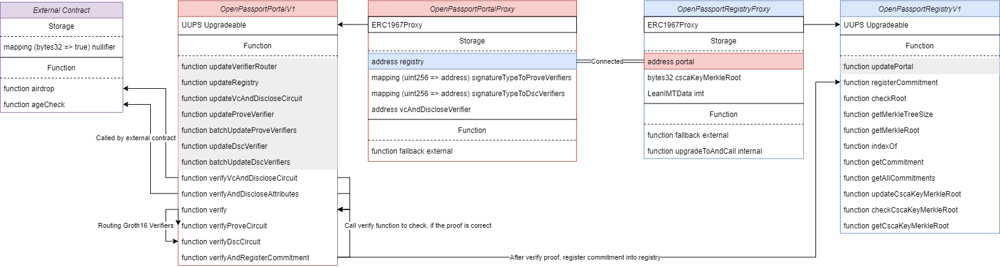

# OpenPassport Contracts

Contracts for OpenPassport.

## OpenPassport Contract Architecture



## Cautions

When you do the upgrade, be careful with this storage patterns
- You can not change the order in which the contract state variables are declared, nor their type.
Pls see this page for more details: https://docs.openzeppelin.com/upgrades-plugins/writing-upgradeable#modifying-your-contracts

## When you run test and see the coverage
When you compile the circuits, make sure you set the build flag to true for these circuits:
- register_sha256_sha256_sha256_rsa_65537_4096
- dsc_sha256_rsa_65537_4096
- vc_and_disclose

There is the difference in build scripts in circuits directory.
```shell
cd ../circuits/scripts/build/common.sh
```
Change the comment out place depends on your OS.

```shell
cd ../circuits
yarn run build-all
cd ../contracts
yarn run test:coverage:local
```
